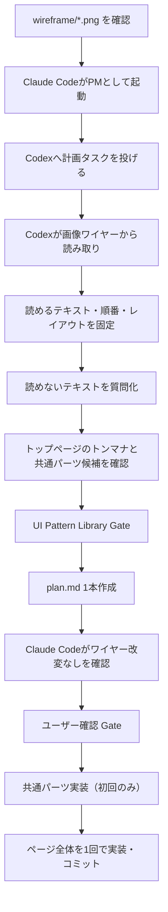

# kisumi 下層ページ制作ワークフロー（画像ワイヤー・プレースホルダー版）

> [!summary]
> ワイヤーフレームは画像で共有され、ページ画像はプレースホルダーとして扱う。AIはワイヤー画像から読み取れるテキスト・順番・レイアウトを固定し、トップページのトンマナと共通パーツを適用して実装する。

<h2 style="color:#f2994a;">基本方針</h2>

| 項目 | 方針 |
|---|---|
| 正本 | `/Users/tomoyukikishi/Desktop/wordpress/kisumi/wireframe/*.png` |
| テキスト | ワイヤー画像から読める範囲で完全一致。読めない箇所は質問化 |
| セクション順 | ワイヤー画像通り |
| レイアウト | ワイヤー画像の基本レイアウト通り |
| デザイン | 既存トップページのトンマナを踏襲 |
| セクションタイトル | 共通見出し化。必要なら `c-sec-title` 相当を作る |
| 繰り返しレイアウト | 共通クラス化 |
| 画像 | プレースホルダー。最終画像ではない前提で計画する |
| 画像ファイル名 | 使用前に意味のある英語名へ変更して `img/` に配置 |
| alt | プレースホルダーでも用途に応じて方針を決める |
| コミット | タスクごとにコミット |

<h2 style="color:#f2994a;">参照ファイル</h2>

- `AGENTS.md`
- `CLAUDE.md`
- `rules/lower-image-wire.md`
- `skills/wordpress-lower-page-image-wire-planning/SKILL.md`
- `../../CLAUDE.md`
- `../../rules/.clauderules-common.md`
- `../../rules/.clauderules-lower.md`
- `../../rules/.codingrules-common.md`
- `../../rules/.codingrules-scss.md`
- `~/Documents/Obsidian Vault/wiki/ui-patterns/INDEX.md`
- `~/Documents/Obsidian Vault/wiki/wordpress/yaotemp/gotchas.md`

<h2 style="color:#f2994a;">全体フロー</h2>



<h2 style="color:#f2994a;">Step 1: Wire Image Intake</h2>

対象ページに対応するワイヤー画像を確認する。

- `/Users/tomoyukikishi/Desktop/wordpress/kisumi/wireframe/wire1.png`
- `/Users/tomoyukikishi/Desktop/wordpress/kisumi/wireframe/wire2.png`
- `/Users/tomoyukikishi/Desktop/wordpress/kisumi/wireframe/wire3.png`
- `/Users/tomoyukikishi/Desktop/wordpress/kisumi/wireframe/wire4.png`
- `/Users/tomoyukikishi/Desktop/wordpress/kisumi/wireframe/wire5.png`
- `/Users/tomoyukikishi/Desktop/wordpress/kisumi/wireframe/wire6.png`
- `/Users/tomoyukikishi/Desktop/wordpress/kisumi/wireframe/wire7.png`
- `/Users/tomoyukikishi/Desktop/wordpress/kisumi/wireframe/wire8.png`

読み取るもの:

- section order
- heading hierarchy
- readable text
- button/link labels
- image slots
- repeated layout shapes
- PC/SPの見え方が分かる場合の差分

読めない文字は推測しない。`content-notes.md` に「要確認」として残す。

<h2 style="color:#f2994a;">Step 2: Placeholder Image Plan</h2>

画像はプレースホルダーとして扱う。

- `img/draft/` または既存 `img/` から仮画像を選ぶ。
- 使用する画像だけ `img/` 直下へコピーする。
- `image copy 10.jpg` や `frame-627321.jpg` のような名前のまま使わない。
- 用途が分かる英語名にする。
- final image replacement note を `image-plan.md` に残す。

例:

| NG | OK |
|---|---|
| `image copy 10.jpg` | `placeholder-staff-consultation.jpg` |
| `frame-627321.jpg` | `placeholder-renovation-kitchen.jpg` |

<h2 style="color:#f2994a;">Step 3: Component Mapping</h2>

トップページ・既存下層ページ・UI Pattern Libraryから流用候補を選ぶ。

- section title
- lead block
- card grid
- image/text block
- flow/step block
- FAQ block
- CTA block

ワイヤー画像の形に合う場合だけ使う。パターンに合わせてワイヤーを変えない。

<h2 style="color:#f2994a;">Step 4: Planning Output</h2>

実装前に以下を**1本**作る。

- `.ai-work/lower/{slug}/plan.md`

`plan.md` に含める内容:

- セクション構成テーブル（ワイヤー通りの順）
- ページ固有クラス設計
- 画像スロット表（ソース候補・比率・リネーム後ファイル名・alt方針）
- 未確定テキスト（要確認事項）

Claude Codeは、これを見て以下を確認する。

- ワイヤー画像の内容を勝手に変えていない
- 読めないテキストを推測していない
- 画像がプレースホルダーとして明記されている
- 共通パーツ化候補が整理されている
- 実装タスクへ分解できる

<h2 style="color:#f2994a;">Step 5: Implementation Units</h2>

良いタスク粒度:

- 1ページ分の `plan.md` を作る
- 共通パーツ（初回のみ）を実装・コミットする
- ページ全体のSCSS + 最小限PHPクラス追加を**1回の Codex 派遣**で実装・コミットする

Codex 派遣プロンプトテンプレ:

```
作業: themes/yaotemp/.ai-work/lower/<slug>/plan.md に沿って
themes/yaotemp/css/design.scss に <slug> 用のページスコープSCSSを追加。
ルールは rules/.codingrules-scss.md と rules/.clauderules-lower.md を参照。
PHPは page-<slug>.php に必要最小限のclass追加のみ。
完了後 git add → commit（タイトル: style(<slug>): apply design）。
```

悪いタスク粒度:

- 下層ページ全部作って
- ワイヤー画像をいい感じに補完して
- 読めない文字をそれっぽく入れて
- 画像は適当に選んで
- 既存ページ全部に影響する共通CSSをまとめて直して

<h2 style="color:#f2994a;">Review Checklist</h2>

- ワイヤー画像から読めるテキストと一致している
- 読めないテキストは質問化している
- セクション順がワイヤー画像通り
- 基本レイアウトがワイヤー画像通り
- トップページのトンマナと自然に合っている
- 共通化できるレイアウトが共通クラス化されている
- プレースホルダー画像が意味のある英語名で `img/` に置かれている
- alt方針がある
- `plan.md` に 1000px / 768px / 560px のブレークポイント対応が SCSS で記述されている
- `git diff` でページスコープ以外への副作用がないことを確認している

<h2 style="color:#f2994a;">Claude Code Start Prompt</h2>

```text
Claude CodeをPM、Codexをworkerとして、kisumiの下層ページ制作を進めます。

前提:
- テーマは /Users/tomoyukikishi/Desktop/wordpress/kisumi/themes/yaotemp
- ワイヤーは画像共有です
- ワイヤー画像は /Users/tomoyukikishi/Desktop/wordpress/kisumi/wireframe/ にあります
- 画像はプレースホルダーです
- テキスト、セクション順、基本レイアウトはワイヤー画像を正本にします
- 読めないテキストは推測せず、質問化してください

まず、以下を読んでください。

- AGENTS.md
- CLAUDE.md
- docs/lower-page-image-wire-workflow.md
- rules/lower-image-wire.md
- skills/wordpress-lower-page-image-wire-planning/SKILL.md
- ../../CLAUDE.md
- ../../rules/.clauderules-common.md
- ../../rules/.clauderules-lower.md
- ../../rules/.codingrules-common.md
- ../../rules/.codingrules-scss.md

次に、Codexへ下層ページ計画タスクを投げてください。

Codexに依頼する内容:
- skills/wordpress-lower-page-image-wire-planning/SKILL.md を参照する
- 対象ワイヤー画像から、読めるテキスト、セクション順、見出し階層、基本レイアウト、画像枠、ボタン/リンク位置を抽出する
- 読めないテキストは推測せず、plan.md の「未確定テキスト」セクションに要確認として記録する
- トップページと既存下層ページのトンマナから流用候補を整理する
- セクションタイトルは共通パーツ化を前提にする
- 同じ形のレイアウトは共通クラス化候補として整理する
- .ai-work/lower/{slug}/plan.md を1本作成する（image-plan / content-notes は別ファイルにしない）
- 実装にはまだ入らない

重要:
- コピーを追加・修正しない
- セクションを追加・削除・並べ替えしない
- ワイヤーにないCTA、装飾、アイコン、導線を足さない
- プレースホルダー画像は使用前に意味のある英語ファイル名へ変更し、img/直下へ配置する
- 画像は最終素材ではないことをimage-plan.mdに残す
- 計画作成後、ユーザー承認まで実装しない
```
